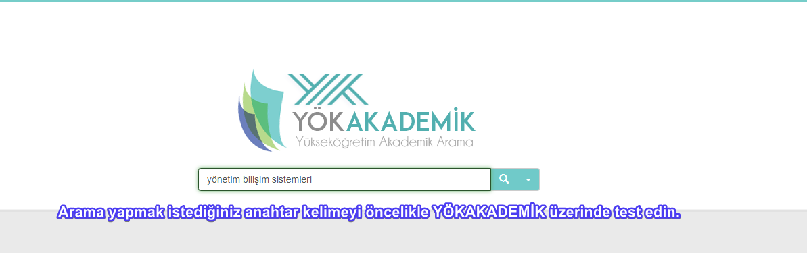
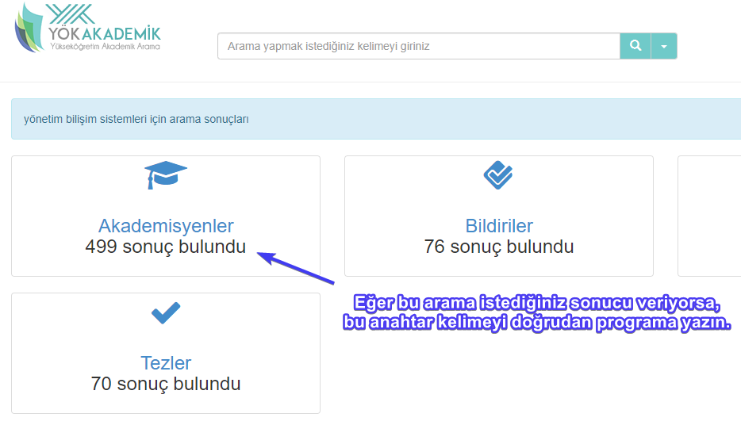
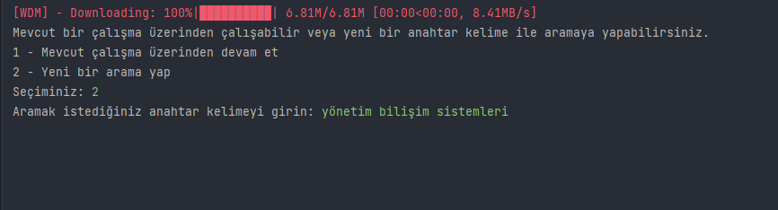

# YOKAkademikScraper
YÖK Akademik üzerinden, belirlenen keyword ile bütün akademisyenleri listeleyecek, her birine ait makale, kitap ve bildirilere ait bilgileri, kişinin mevcut ünvan ve e-posta adresini, akademik ünvan ve eğitim geçmişini kaydetmeye yarayan araç.

Çalışmayı verimli kullanabilmek için öncelikle istediğiniz sonuçlara yönelik bir arama anahtar kelimesi belirlemeli, belirlediğiniz anahtar kelimeyi test etmelisiniz.

Burada arama butonuna bastığınızda karşınıza aradığınız anahtar kelimeyle ilgili bir arama sonucu ekranı çıkacaktır.

Eğer istediğiniz sonuçlar buradaysa, bu anahtar kelimeyi doğrudan programa işleyebilirsiniz.

Programın 2 temel aşaması vardır.
1 - Anahtar kelimeyle gelen bütün akademisyenleri alıp kaydetmek, 
2 - Kaydedilen bütün akademisyenlerin profilinde gezerek her profilden akademisyenlere ait bilgileri almak. 

Programın 2 temel modu vardır.
1 - Sıfırdan bir proje başlatabilirsiniz. Bu proje ile akademisyenleri belirlediğiniz anahtar kelime ile arayabilirsiniz. Arama tamamlanıp, bütün akademisyenlerin temel bilgileri (GUID) elde edildikten sonra, program size profil gezme işlemini şimdi yapıp yapmak istemediğinizi soracaktır. Eğer istemezseniz kapatabilir, kaldığınız yerden daha sonra devam edebilirsiniz.
2 - Mevcut bir projeden devam etmek. Mevcut projeden devam etmek isterseniz proje anahtar kelimesini tekrar girmeniz gerekecektir. Örneğin daha öncesinde "yönetim bilişim sistemleri" isimli bir arama yaptıysanız, birebir aynı kelime yazmanız gerekiyor. 
Program profilleri gezerken kapatılırsa, tekrar açıldığında sıfırdan başlar ve mevcut dosyaların üzerine yazarak devam eder.

## Önemli Uyarı
Eğer çalışma OneDrive / Google Drive gibi sürekli yedeklenen bir klasörde çalışıyorsa 'dosya bulunamadı' hatası alabilirsiniz. Programı yedeklenmeyen bir yerde çalıştırın lütfen.

sorularınız için bana ulaşabilirsiniz. oari@sakarya.edu.tr
